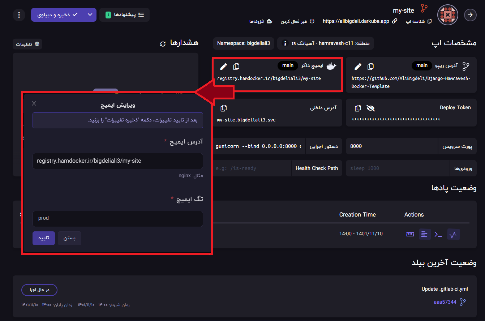

<div align="center">

<h1 align="center">Django3.2 Hamravesh Docker Celery Template</h1>
<h3 align="center">Sample Project to use hamravesh service provider for django app and celery for background tasks</h3>
</div>
<p align="center">
<a href="https://www.python.org" target="_blank">  </a>
<a href="https://www.djangoproject.com/" target="_blank">  </a> 
<a href="https://www.docker.com/" target="_blank">  </a>
<a href="https://www.postgresql.org" target="_blank">  </a>
<a href="https://www.nginx.com" target="_blank">  </a>
<a href="https://git-scm.com/" target="_blank">  </a>
<a href="https://hamravesh.com/" target="_blank">  </a>
</p>

# Guideline
- [Guideline](#guideline)
- [Goal](#goal)
- [Video Instructions](#video-instructions)
- [Development usage](#development-usage)
  - [Clone the repo](#clone-the-repo)
  - [Enviroment Varibales](#enviroment-varibales)
  - [Build everything](#build-everything)
  - [Note](#note)
  - [Check it out in a browser](#check-it-out-in-a-browser)
- [Testing Usage](#testing-usage)
  - [running all tests](#running-all-tests)
- [Hamravesh deployment](#hamravesh-deployment)
  - [0- Create an account](#0--create-an-account)
  - [1- Setup database](#1--setup-database)
  - [2- Create a repo app](#2--create-a-repo-app)
  - [3- Setup django app (Backend)](#3--setup-django-app-backend)
  - [4- Setup Worker](#4--setup-worker)
  - [5- Setup Beater](#5--setup-beater)
- [CICD Deployment](#cicd-deployment)
  - [Github CICD](#github-cicd)
  - [Gitlab/Hamgit CICD](#gitlabhamgit-cicd)
    - [Setup Worker and Beater](#setup-worker-and-beater)
    - [Setup Environments](#setup-environments)
- [Sentry Logger](#sentry-logger)
- [License](#license)
- [Bugs](#bugs)

# Goal
This project main goal is to provide a simple way to deploy a django project into hamravesh service provider.

# Video Instructions
<div align="center" ></div>

# Development usage
You'll need to have [Docker installed](https://docs.docker.com/get-docker/).
It's available on Windows, macOS and most distros of Linux. 

If you're using Windows, it will be expected that you're following along inside
of [WSL or WSL
2](https://nickjanetakis.com/blog/a-linux-dev-environment-on-windows-with-wsl-2-docker-desktop-and-more).

That's because we're going to be running shell commands. You can always modify
these commands for PowerShell if you want.


## Clone the repo
Clone this repo anywhere you want and move into the directory:
```bash
git clone https://github.com/AliBigdeli/Django-Hamravesh-Docker-Celery-Template.git
```

## Enviroment Varibales
enviroment varibales are included in docker-compose.yml file for debugging mode and you are free to change commands inside:

```yaml
services:

  redis:
    container_name: redis
    image: redis
    restart: always
    expose:
      - "6379"
    command: redis-server --save 60 1 --loglevel warning

  db:
    container_name: db
    image: postgres:alpine
    volumes:
      - ./postgre/data:/var/lib/postgresql/data
    expose:
      - 5432
    env_file:
      - ./envs/dev/postgre/.env

    restart: always

  backend:
    build:
      context: .
      dockerfile: dockerfiles/dev/django/Dockerfile
    container_name: backend
    command: sh -c "python manage.py check_database && \ 
                    yes | python manage.py makemigrations  && \
                    yes | python manage.py migrate  && \
                    python manage.py runserver 0.0.0.0:8000"
    volumes:
      - ./core:/usr/src/app
    ports:
      - 8000:8000
    env_file:
      - ./envs/dev/django/.env
    restart: always
    depends_on:
      - db
    healthcheck:
      test: ['CMD-SHELL', 'pg_isready -U postgres']
      interval: 10s
      timeout: 5s
      retries: 5

  celery_worker:
    build:
      context: .
      dockerfile: dockerfiles/dev/django/Dockerfile
    command: celery -A core worker --loglevel=info
    container_name: weather-celery_worker
    volumes:
      - ./core:/usr/src/app
    env_file:
      - ./envs/dev/django/.env
    restart: always
    depends_on:
      - redis
      - db
      - backend

  celery_beat:
    build:
      context: .
      dockerfile: dockerfiles/dev/django/Dockerfile
    command: celery -A core beat -l info
    container_name: weather-celery_beat
    volumes:
      - ./core:/usr/src/app
    env_file:
      - ./envs/dev/django/.env

    restart: always
    depends_on:
      - redis
      - db
      - backend


```

## Build everything

*The first time you run this it's going to take 5-10 minutes depending on your
internet connection speed and computer's hardware specs. That's because it's
going to download a few Docker images and build the Python + requirements dependencies.*

```bash
docker compose up --build
```

Now that everything is built and running we can treat it like any other Django
app.

## Note

If you receive an error about a port being in use? Chances are it's because
something on your machine is already running on port 8000. then you have to change the docker-compose.yml file according to your needs.
## Check it out in a browser

Visit <http://localhost:8000> in your favorite browser.

# Testing Usage
## running all tests
```bash
docker compose run --rm backend sh -c " black -l 79 && flake8 && python manage.py test" -v core:/app
```
or
```bash
docker compose exec backend sh -c sh -c " black -l 79 && flake8 && python manage.py test" 
```

# Hamravesh deployment

## 0- Create an account
for this section please follow the instructions for General Deployment of hamravesh projects provided here:

<https://github.com/AliBigdeli/Django-Hamravesh-Docker-Template#0--create-an-account>


## 1- Setup database
for this section please follow the instructions for General Deployment of hamravesh projects provided here:

<https://github.com/AliBigdeli/Django-Hamravesh-Docker-Template#2--setup-database>

## 2- Create a repo app
in order to deploy your project you can use repo mode (or منبع گیت) after clicking on the item. you will see a panel like this below:

<div align="center" ></div>

as you can see you have to provide your github/gitlab/hamgit repo address for deployment. 
in our case the configuration will be as follow:

``` properties
repo_address: https://github.com/AliBigdeli/Django-Hamravesh-Docker-Template.git
# if you are just testing without cicd use main or if you want to use cicd script to delpoy create a prod branch and then add it here
branch_name: main
build_context: .
docker_file_address: ./dockerfiles/prod/django/Dockerfile
```
Note: as we are going to implement ci/cd and other stuffs we avoid auto deployment or even uploading file.

after your done with the inputs just click on (تنظیمات اپ) and go for next step.


## 3- Setup django app (Backend)
for this section please follow the instructions for General Deployment of hamravesh projects provided here:

<https://github.com/AliBigdeli/Django-Hamravesh-Docker-Template#3--setup-django-app>

## 4- Setup Worker
Just Like what you have done in ```setup django app``` section you will do everything the same except that for configuration of the app there will be some minor changes 
1 - Create the app based on repo and proceed to the general info section, and put these info:
```properties
app_name: my-site-worker # name of the app which is going to be called inside the portal
service_port:  # leave this field as empty cause our service wont have outer access
execute_command: celery -A core worker --loglevel=info
```
2- Environments:
just as usual put all the environments that your project needs

3- Domains:
in this section dont add anything cause we are not going to use the app through the web, instead it will be called through the signals between apps and broker.

4- plan:
choose the correct plan for using the app, note that sometimes your app might go through loops cause of limited sources so that you need to upgrade the plan to find the better performance for that.

5- Deploy:
Lastly wait till the app is up and running correctly.

## 5- Setup Beater
Just Like what you have done in ```setup django app``` section you will do everything the same except that for configuration of the app there will be some minor changes 
1 - Create the app based on repo and proceed to the general info section, and put these info:
```properties
app_name: my-site-worker # name of the app which is going to be called inside the portal
service_port:  # leave this field as empty cause our service wont have outer access
execute_command: celery -A core beat -l info
```
2- Environments:
just as usual put all the environments that your project needs

3- Domains:
in this section dont add anything cause we are not going to use the app through the web, instead it will be called through the signals between apps and broker.

4- plan:
choose the correct plan for using the app, note that sometimes your app might go through loops cause of limited sources so that you need to upgrade the plan to find the better performance for that.

5- Deploy:
Lastly wait till the app is up and running correctly.

# CICD Deployment
For the sake of continuous integration and deployment i have provided two samples for github and gitlab/hamgit for you.
but there will be some configurations to be added for building and deploying purposes.

## Github CICD
will be provided soon

## Gitlab/Hamgit CICD

### Setup Worker and Beater
before going to configure cicd there is a little change that you need to make in the worker and beater configs in hamravesh panel, the docker image and tag of each app should be pointed to backend image and tag in order for cicd to work correctly. in order to do that just follow the instructions bellow:

1- go to the backend app page, click on ```edit``` in ```image docker section```, then copy the provided link and tag something like: ```registry.hamdocker.ir/bigdeliali3/my-site``` and tag as in "prod" (which will be set when you go though cicd cycle but will be as prod forever)
<div align="center" ></div>

2- then go to the woker app page, again click on ```edit``` in ```image docker section``` , replace the link and tag with the copied info from backend app.
3- then go to the beater app page, again click on ```edit``` in ```image docker section``` , replace the link and tag with the copied info from backend app.

and now your good to go. 

### Setup Environments
in order to do ci/cd in the sample project for gitlab/hamgit you have to create a duplicate of the ```.gitlab-ci.yml.sample``` but with different name as ```.gitlab-ci.yml``` in the root directory.

after that our pipeline will be always listening to the prod branch. if you commit in this branch it will go through the process.

note that you have to declare 5 or more environment variables in your gitlab/hamgit project repo, which you can add it by going to ```Settings>CI/CD>Variables```, and in this section try to add all the needed variables.


<div align="center" ></div>

these variables should be included:
- DARKUBE_APP_ID_BACKEND - ``` which can be found in app info page of the backend project```
- DARKUBE_DEPLOY_TOKEN_BACKEND - ``` which can be found in app info page of the backend project ```
- DARKUBE_APP_ID_WORKER - ``` which can be found in app info page of the worker project```
- DARKUBE_DEPLOY_TOKEN_WORKER - ``` which can be found in app info page of the worker project ```
- DARKUBE_APP_ID_BEATER - ``` which can be found in app info page of the beater project```
- DARKUBE_DEPLOY_TOKEN_BEATER - ``` which can be found in app info page of the beater project ```
- IMAGE -  ``` registry.hamdocker.ir/<USERNAME>/<APPNAME> ```
- REGISTERY - ``` registry.hamdocker.ir/<USERNAME> ```
- REGISTERY_PASSWORD - ``` registry password ```
- REGISTERY_USER - ``` username like 'bigdeliali3' ```


for having ```DARKUBE_APP_ID_xxxxx``` and ```DARKUB_DEPLOY_TOKEN_xxxxx``` head to the app page and use the following parameters in the picture.

<div align="center" ></div>
  
for having ```REGISTRY``` and ```REGISTRY_USER``` and ```REGISTRY_PASSWORD``` head to the app page and use the following parameters in the picture.
REGISTRY will be the url like this: ```registry.hamdocker.ir/<USERNAME>```
and for getting the username and passwords just go to the app section and click on docker image. you will see something like this, after that click on registries.
<div align="center" ></div>

On top of the page you can find the credentials for registry that you need.
<div align="center" ></div>
after that if everything goes well you can see that the jobs are working.

# Sentry Logger
for this section please follow the instructions for General Deployment of hamravesh projects provided here:

<https://github.com/AliBigdeli/Django-Hamravesh-Docker-Template#sentry-logger>

# License
MIT.


# Bugs
Feel free to let me know if something needs to be fixed. or even any features seems to be needed in this repo.
